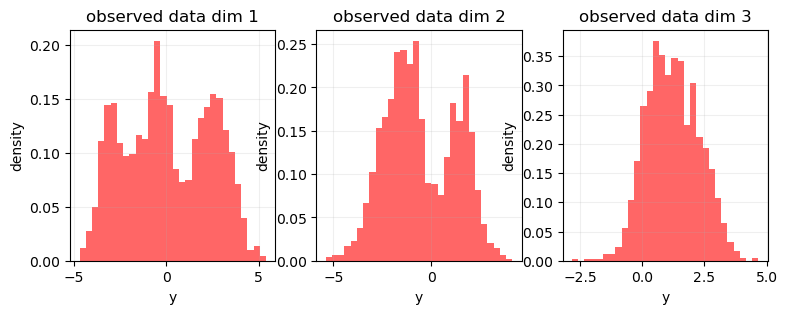
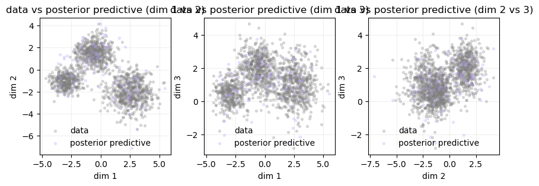
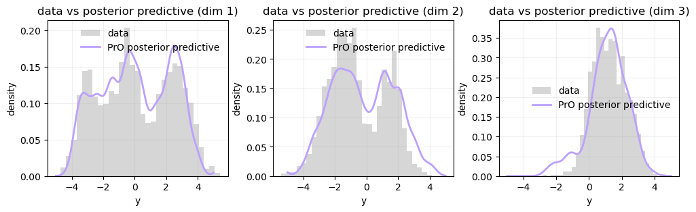
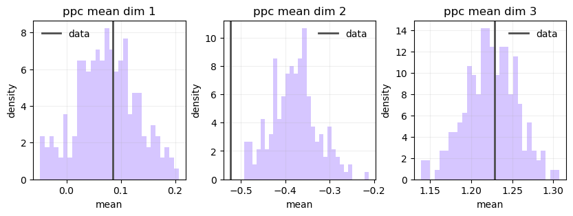
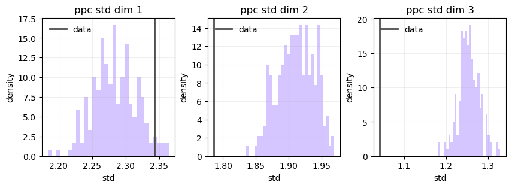
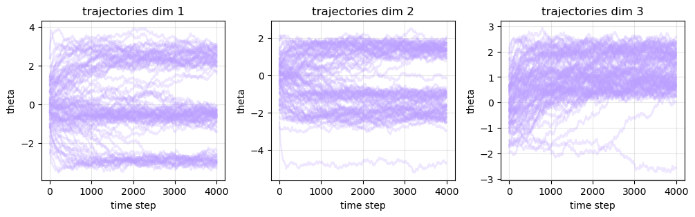
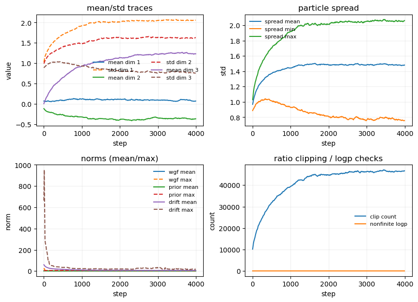

## A first working PrO posterior experiment

I worked on a simple PoC implementation of the PrO posterior update on synthetic data. To keep the behaviour easy to inspect, I generated a 3D Gaussian mixture and treated it as the observed dataset. Starting from randomly initialized particles, I then ran the particle update using the log-score Wasserstein gradient flow (WGF) interaction term together with the prior gradient and a small Gaussian noise term.

You can view the notebook here: [PrO testing notebook]({{ '/misc/prop-testing-notebook/' | relative_url }}).

The main goal of this notebook was to verify that the particle system was moving in a sensible direction. The 1D marginal plots showed that the particles quickly moved away from their initial random configuration and began matching the structure of the observed data. In the pairwise scatter plots, the final particles concentrated around the same three clusters visible in the observations, suggesting that the posterior approximation was successfully capturing the multimodal structure of the target distribution.

The particle trajectory plots revealed an initial adaptation phase followed by much more stable motion once the particles had located the dominant regions of posterior mass. This behaviour was also reflected in the diagnostics. The particle spread increased during the early stages of optimisation and then stabilised, while both the WGF interaction norm and the overall drift norm decreased from their initially large values to a much more controlled regime. I also did not observe any non-finite log-density evaluations, which provided confidence that the numerical implementation was behaving correctly. One quantity worth monitoring in future experiments is the log-ratio clipping mechanism, which became increasingly active as training progressed.

To move beyond simple visual inspection of the particles, I also added posterior predictive checks. Using the learned particle approximation, I generated replicated observations from the predictive mixture implied by the particle system and compared them against the original dataset. The replicated marginals closely matched the observed marginals, indicating that the learned posterior was not only locating the correct modes but was also reproducing the overall distribution of the data. I further generated multiple replicated datasets and compared summary statistics such as the mean and standard deviation with those of the observations. In each case, the observed statistics lay comfortably within the bulk of the posterior predictive distributions, providing additional evidence that the posterior approximation was well calibrated for this synthetic example.

Overall, this served as a useful first sanity check. The experiment suggests that the PrO posterior implementation is behaving as expected, recovering the coarse multimodal structure of the target distribution while also producing posterior predictive samples that remain consistent with the observed data.

## Results

